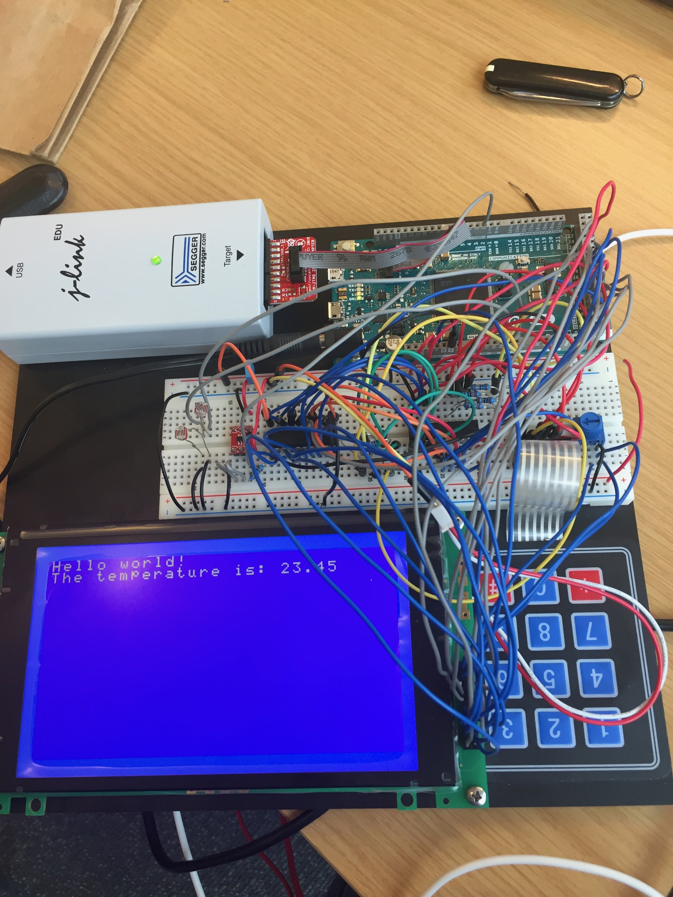
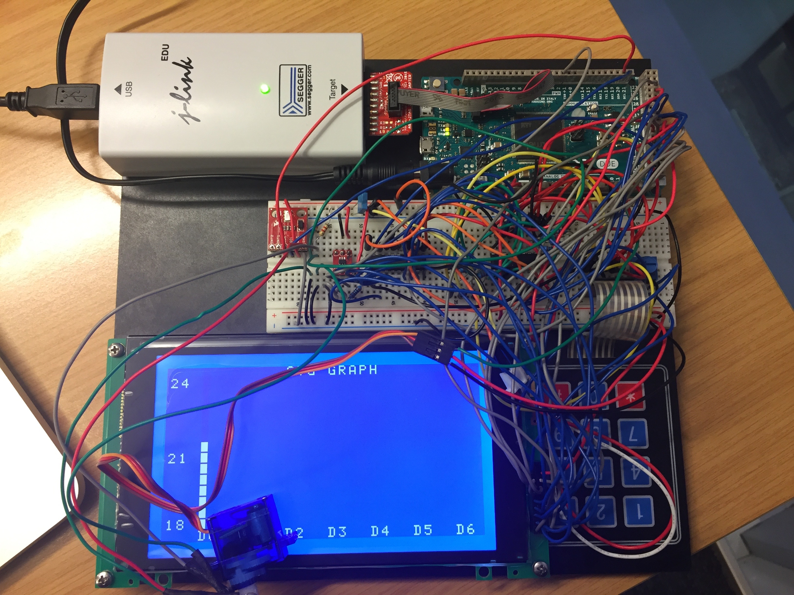

# Weather Station

This project was done during the winter of 2017, in Halmstad, Sweden, when I was an exchange student there.

The weather station is based on Arduino, the following funcions have been implemented:

1. show text with an LCD display
2. input characters with a keypad
3. monitor temperature with a temperature sensor
    - display real time temperature
    - draw a graph of temperature in the last 7 days
4. track light source with a light sensor and a servo motor
    - the servo motor will always point to the light source
5. monitor pressure with a pressure sensor

I lost track of the details of the sensors I used, sorry about that.    
I developed it with IAR Embedded Workbench, which belongs to a Swedish company, quite cool.    
I had absolutely no idea about hardware when I started this project, that's why you can see messy wires on the board and crazy delays everywhere in the code :)       

These two pictures can show what I did:   

I missed the days in Sweden a lot.    

